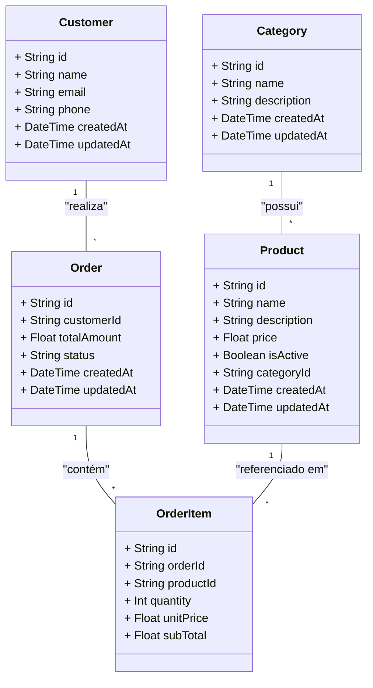

# Diagrama de Código (Nível 4) - Backend

Este diagrama detalha as estruturas das entidades principais do Domínio do Backend (Produtos, Clientes, Pedidos, Itens de Pedido e Categorias) e seus relacionamentos.

