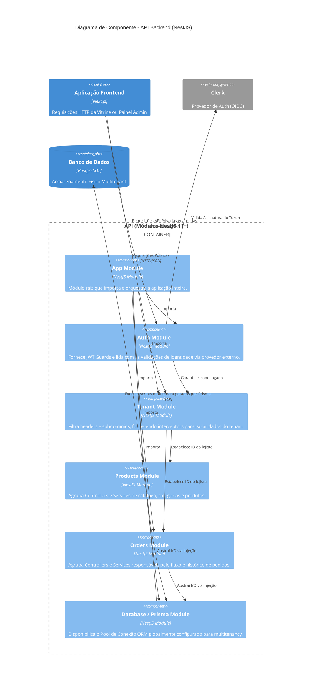

# Diagrama de Componente - Backend

```mermaid
C4Component
    title Diagrama de Componente - API Backend (NestJS)

    Container(frontend, "Aplicação Frontend", "Next.js", "Requisições HTTP da Vitrine ou Painel Admin")
    System_Ext(clerk, "Clerk", "Provedor de Auth (OIDC)")
    ContainerDb(database, "Banco de Dados", "PostgreSQL", "Armazenamento Físico Multitenant")

    Container_Boundary(backend_api, "API (Módulos NestJS 11+)") {
        Component(app_module, "App Module", "NestJS Module", "Módulo raiz que importa e orquestra a aplicação inteira.")
        
        Component(auth_module, "Auth Module", "NestJS Module", "Fornece JWT Guards e lida com as validações de identidade via provedor externo.")
        Component(tenant_module, "Tenant Module", "NestJS Module", "Filtra headers e subdomínios, fornecendo interceptors para isolar dados do tenant.")
        
        Component(products_module, "Products Module", "NestJS Module", "Agrupa Controllers e Services de catálogo, categorias e produtos.")
        Component(orders_module, "Orders Module", "NestJS Module", "Agrupa Controllers e Services responsáveis pelo fluxo e histórico de pedidos.")
        
        Component(database_module, "Database / Prisma Module", "NestJS Module", "Disponibiliza o Pool de Conexão ORM globalmente configurado para multitenancy.")
    }

    Rel_D(frontend, tenant_module, "Requisições Públicas", "HTTP/JSON")
    Rel_D(frontend, auth_module, "Requisições API Privadas guardadas", "HTTP/Bearer JWT")

    Rel_D(app_module, auth_module, "Importa")
    Rel_D(app_module, tenant_module, "Importa")
    Rel_D(app_module, products_module, "Importa")
    Rel_D(app_module, orders_module, "Importa")
    Rel_D(app_module, database_module, "Importa")

    Rel(auth_module, clerk, "Valida Assinatura do Token")
    Rel_D(auth_module, tenant_module, "Garante escopo logado")
    
    Rel_D(tenant_module, products_module, "Estabelece ID do lojista")
    Rel_D(tenant_module, orders_module, "Estabelece ID do lojista")

    Rel(products_module, database_module, "Abstrai I/O via injeção")
    Rel(orders_module, database_module, "Abstrai I/O via injeção")

    Rel_D(database_module, database, "Executa scripts multitenant gerados por Prisma", "TCP")
```
