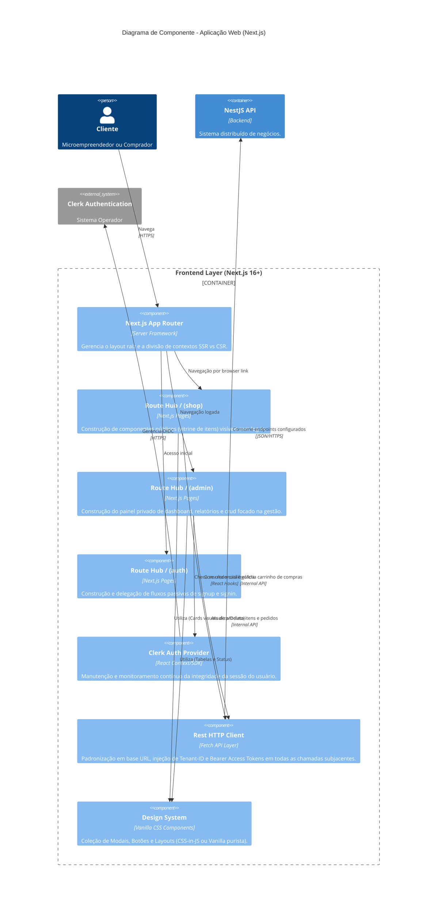

# Diagrama de Componente - Frontend

```mermaid
C4Component
    title Diagrama de Componente - Aplicação Web (Next.js)

    Person(customer, "Cliente", "Microempreendedor ou Comprador")

    Container_Boundary(frontend_app, "Frontend Layer (Next.js 16+)") {
        
        Component(app_router, "Next.js App Router", "Server Framework", "Gerencia o layout raiz e a divisão de contextos SSR vs CSR.")
        
        Component(shop_routes, "Route Hub / (shop)", "Next.js Pages", "Construção de componentes públicos (vitrine de itens) visíveis sem log-in.")
        Component(admin_routes, "Route Hub / (admin)", "Next.js Pages", "Construção do painel privado de dashboard, relatórios e crud focado na gestão.")
        Component(auth_routes, "Route Hub / (auth)", "Next.js Pages", "Construção e delegação de fluxos passivos de signup e signin.")
        
        Component(auth_provider, "Clerk Auth Provider", "React Context/SDK", "Manutenção e monitoramento contínuo da integridade da sessão do usuário.")
        Component(api_client, "Rest HTTP Client", "Fetch API Layer", "Padronização em base URL, injeção de Tenant-ID e Bearer Access Tokens em todas as chamadas subjacentes.")
        
        Component(ui_components, "Design System", "Vanilla CSS Components", "Coleção de Modais, Botões e Layouts (CSS-in-JS ou Vanilla purista).")
    }

    Container(backend, "NestJS API", "Backend", "Sistema distribuído de negócios.")
    System_Ext(clerk, "Clerk Authentication", "Sistema Operador")

    Rel(customer, app_router, "Navega", "HTTPS")

    Rel(app_router, shop_routes, "Navegação por browser link")
    Rel(app_router, admin_routes, "Navegação logada")
    Rel(app_router, auth_routes, "Acesso inicial")
    
    Rel(shop_routes, ui_components, "Utiliza (Cards visuais de produto)")
    Rel(admin_routes, ui_components, "Utiliza (Tabelas e Status)")
    
    Rel(admin_routes, auth_provider, "Checa se credencial é válida", "React Hooks")
    Rel(shop_routes, api_client, "Consulta o catálogo/cria carrinho de compras", "Internal API")
    Rel(admin_routes, api_client, "Atualiza/Deleta itens e pedidos", "Internal API")
    
    Rel(auth_provider, clerk, "Gerencia OIDC", "HTTPS")
    Rel(api_client, backend, "Consome endpoints configurados", "JSON/HTTPS")
```
