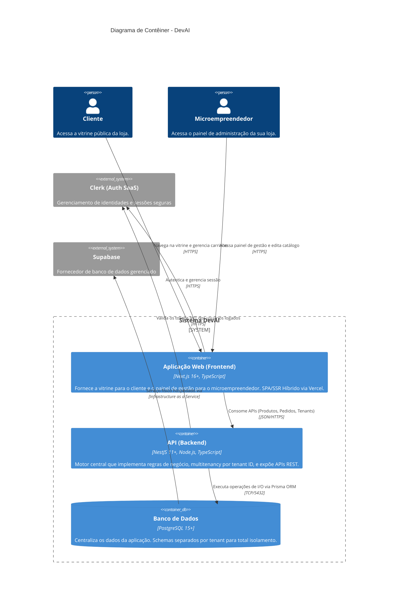

# Diagrama de Contêiner - DevAI

```mermaid
C4Container
    title Diagrama de Contêiner - DevAI

    Person(customer, "Cliente", "Acessa a vitrine pública da loja.")
    Person(admin, "Microempreendedor", "Acessa o painel de administração da sua loja.")

    System_Boundary(devai_system, "Sistema DevAI") {
        Container(frontend, "Aplicação Web (Frontend)", "Next.js 16+, TypeScript", "Fornece a vitrine para o cliente e o painel de gestão para o microempreendedor. SPA/SSR Híbrido via Vercel.")
        Container(backend, "API (Backend)", "NestJS 11+, Node.js, TypeScript", "Motor central que implementa regras de negócio, multitenancy por tenant ID, e expõe APIs REST.")
        ContainerDb(database, "Banco de Dados", "PostgreSQL 15+", "Centraliza os dados da aplicação. Schemas separados por tenant para total isolamento.")
    }

    System_Ext(clerk, "Clerk (Auth SaaS)", "Gerenciamento de identidades e sessões seguras")
    System_Ext(supabase, "Supabase", "Fornecedor de banco de dados gerenciado")

    Rel(customer, frontend, "Navega na vitrine e gerencia carrinho", "HTTPS")
    Rel(admin, frontend, "Acessa painel de gestão e edita catálogo", "HTTPS")
    
    Rel(frontend, backend, "Consome APIs (Produtos, Pedidos, Tenants)", "JSON/HTTPS")
    Rel(frontend, clerk, "Autentica e gerencia sessão", "HTTPS")
    Rel(backend, clerk, "Valida os tokens JWT dos usuários logados", "HTTPS")
    
    Rel(backend, database, "Executa operações de I/O via Prisma ORM", "TCP/5432")
    Rel(database, supabase, "Serviço físico hospedado via", "Infrastructure as a Service")
```
