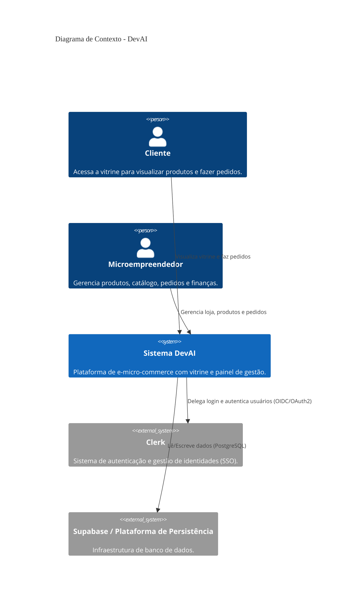

# Diagrama de Contexto - DevAI

```mermaid
%%{init: {"themeVariables": {"fontSize": "16px", "fontFamily": "sans-serif"}}}%%
C4Context
    title Diagrama de Contexto - DevAI

    Person(customer, "Cliente", "Acessa a vitrine para visualizar produtos e fazer pedidos.")
    Person(admin, "Microempreendedor", "Gerencia produtos, catálogo, pedidos e finanças.")

    System(devai, "Sistema DevAI", "Plataforma de e-micro-commerce com vitrine e painel de gestão.")

    System_Ext(clerk, "Clerk", "Sistema de autenticação e gestão de identidades (SSO).")
    System_Ext(supabase, "Supabase / Plataforma de Persistência", "Infraestrutura de banco de dados.")

    Rel_R(customer, devai, "Visualiza vitrine e faz pedidos")
    Rel_L(admin, devai, "Gerencia loja, produtos e pedidos")
    
    Rel_D(devai, clerk, "Delega login e autentica usuários (OIDC/OAuth2)")
    Rel_D(devai, supabase, "Lê/Escreve dados (PostgreSQL)")

    UpdateLayoutConfig($c4ShapeInRow="2", $c4BoundaryInRow="1")
```
