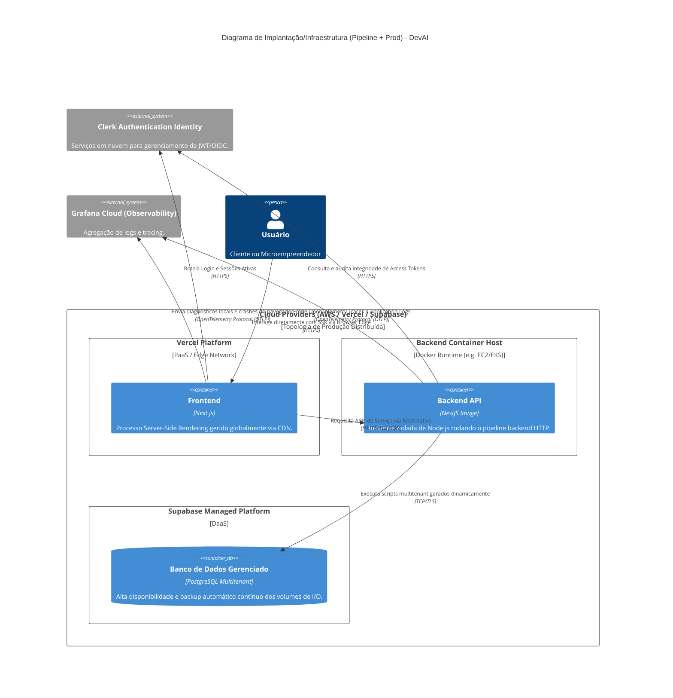

# Diagrama de Implantação (Deployment) - DevAI

```mermaid
C4Deployment
    title Diagrama de Implantação/Infraestrutura (Pipeline + Prod) - DevAI

    Deployment_Node(aws, "Cloud Providers (AWS / Vercel / Supabase)", "Topologia de Produção Distribuída") {
        
        Deployment_Node(vercel, "Vercel Platform", "PaaS / Edge Network") {
            Container(frontend, "Frontend", "Next.js", "Processo Server-Side Rendering gerido globalmente via CDN.")
        }
        
        Deployment_Node(backend_host, "Backend Container Host", "Docker Runtime (e.g. EC2/EKS)") {
            Container(backend, "Backend API", "NestJS Image", "Instância isolada de Node.js rodando o pipeline backend HTTP.")
        }

        Deployment_Node(supabase_host, "Supabase Managed Platform", "DaaS") {
            ContainerDb(database, "Banco de Dados Gerenciado", "PostgreSQL Multitenant", "Alta disponibilidade e backup automático contínuo dos volumes de I/O.")
        }
    }

    System_Ext(clerk, "Clerk Authentication Identity", "Serviços em nuvem para gerenciamento de JWT/OIDC.")
    System_Ext(grafana, "Grafana Cloud (Observability)", "Agregação de logs e tracing.")

    Rel(frontend, backend, "Requisita APIs de Serviço via fetch nativo", "HTTPS/TLS JSON")
    Rel(backend, database, "Executa scripts multitenant gerados dinamicamente", "TCP/TLS")
    
    Rel(frontend, clerk, "Roteia Login e Sessões Ativas", "HTTPS")
    Rel(backend, clerk, "Consulta e audita integridade de Access Tokens", "HTTPS")
    
    Rel(backend, grafana, "Emite OpenTelemetry Traces e Application Logs", "OpenTelemetry Protocol (OTLP)")
    Rel(frontend, grafana, "Envia diagnósticos locais e crashes do navegador", "OpenTelemetry Protocol (OTLP)")
    
    Person(user, "Usuário", "Cliente ou Microempreendedor")
    Rel(user, frontend, "Interage diretamente com SSR via browser Edge", "HTTPS")
```
