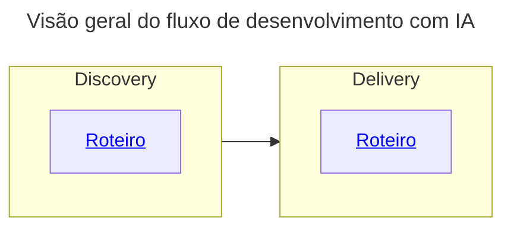

# Roteiro para desenvolvimento de soluções com IA

Os objetivos são:
- Clareza de escopo,
- Redução de ambiguidade,
- Consistência entre requisitos, design e implementação,
- Uso eficiente de modelos de IA como copilotos de desenvolvimento.

Diretrizes gerais:
- Usar saída de cada atividade como contexto para atividade seguinte.
- Usar one shot injection.
- GitHub como single source of truth em todo fluxo.
- Markdown como "língua franca".
